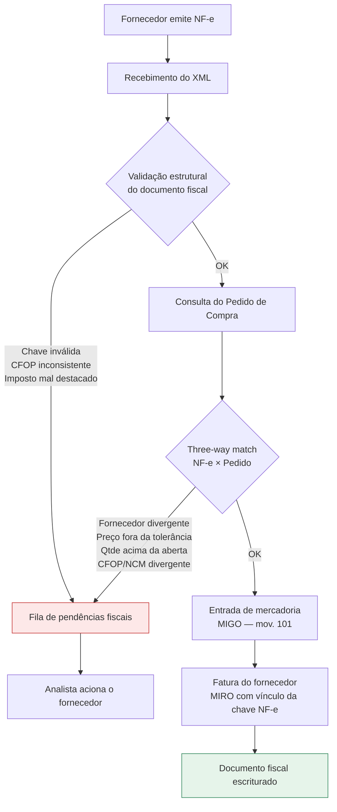

# Recebimento Fiscal SAP MM — da NF-e do fornecedor até a MIRO

Modelagem do processo de recebimento fiscal brasileiro (MM inbound), com as regras de validação de um cenário de compra nacional implementadas e testadas de ponta a ponta.

**O que este projeto demonstra**: domínio do processo de recebimento (ME21N → MIGO → MIRO), das regras da localização Brasil (chave de acesso, CFOP, NCM, destaque de impostos) e dos controles que travam um lançamento indevido.

**O que este projeto não demonstra**: configuração real de SPRO. As regras foram modeladas segundo o comportamento esperado do S/4HANA, não parametrizadas numa instância produtiva. Ver [limitações declaradas](docs/01-matriz-de-regras.md#escopo-e-limitações-declaradas).

📄 **[Matriz de regras de validação](docs/01-matriz-de-regras.md)** — cada regra, onde ela vive no SAP, e o que acontece quando falha
📄 **[Plano de testes](docs/02-plano-de-testes.md)** — 9 casos executados com evidência real

---

## O processo



### Onde cada validação vive no SAP

| Etapa do fluxo | Equivalente no S/4HANA |
|---|---|
| Validação estrutural da NF-e | Monitor de NF-e / GRC NF-e (cockpit J1B*) |
| Cálculo e conferência de impostos | J1BTAX |
| Determinação de CFOP | J1BTAX → CFOP Determinação MM (J_1BAONV) |
| Tolerância de preço na fatura | Chaves de tolerância — OMR6 (PP / DQ) |
| Tolerância de quantidade | Item do pedido — sub/sobreentrega |
| Entrada de mercadoria | MIGO — movimento 101 |
| Fatura do fornecedor | MIRO — com vínculo do documento fiscal |
| Liberação de fatura bloqueada | MRBR |

A lista completa, com motivo de negócio e comportamento em caso de falha, está na **[matriz de regras](docs/01-matriz-de-regras.md)**.

---

## Cenários modelados

| Cenário | Regra exercitada | Resultado |
|---|---|---|
| Recebimento sem divergência | Fluxo completo | MIGO + MIRO lançadas |
| Preço 10% acima do pedido | Tolerância OMR6 | Bloqueado |
| CFOP 5551 (ativo imobilizado) | Determinação de CFOP | Bloqueado |
| Emitente ≠ fornecedor do pedido | Dados mestres do fornecedor | Bloqueado |
| ICMS destacado a menor | Consistência base × alíquota | Bloqueado |
| NF-e já lançada | Duplicidade por chave de acesso | Rejeitado |
| Fatura sem entrada de mercadoria | GR-based IV | Rejeitado |
| Entrada acima da qtde aberta | Sobreentrega (msg M7 022) | Rejeitado |
| Fatura com valor divergente | Bloqueio automático para pagamento | Rejeitado |

Evidência de execução de todos os casos no **[plano de testes](docs/02-plano-de-testes.md)**.

---

## Arquitetura técnica

O processo foi implementado sobre dois componentes que conversam por HTTP, no mesmo padrão de uma integração real:

```
XML da NF-e  ──HTTP──▶  n8n (orquestração)  ──OData v4──▶  S/4HANA (sistema de registro)
                        validações e decisão                 lançamento e regras de negócio
```

**Camada de orquestração — n8n.** Recebe o XML, valida o documento fiscal, consulta o pedido, executa o three-way match e decide entre lançar ou bloquear. Em maio de 2026 a SAP fez investimento estratégico na n8n e firmou parceria para embarcar a plataforma no Joule Studio — este projeto usa exatamente esse padrão de orquestração sobre as APIs do S/4.

**Sistema de registro — mock S/4HANA em SAP CAP.** Expõe APIs OData v4 seguindo a nomenclatura das APIs oficiais (`API_PURCHASE_ORDER_SRV`, `API_MATERIAL_DOCUMENT_SRV`, `API_SUPPLIERINVOICE_PROCESS_SRV`) e implementa as regras do lado do sistema: pedido liberado, quantidade em aberto, GR-based IV, bloqueio automático de fatura por tolerância e duplicidade por chave.

As validações existem **dos dois lados de propósito**: o orquestrador valida antes de chamar, e o sistema de registro valida de novo e rejeita — porque um sistema de registro nunca confia cegamente no integrador. Os casos CT-06 a CT-09 do plano de testes provam isso chamando as APIs diretamente, sem passar pelo n8n.

Apontar o fluxo para um S/4HANA real exigiria trocar a URL base e adicionar autenticação — a estrutura das chamadas permanece.

---

## Estrutura do repositório

```
docs/
  01-matriz-de-regras.md    Regras de validação, ponto de configuração no SAP, tratamento de exceção
  02-plano-de-testes.md     9 casos de teste com evidência de execução
cap-mock/                   Mock S/4HANA (SAP CAP, OData v4, SQLite em memória)
  db/schema.cds               Modelo de dados espelhado nas APIs oficiais
  db/data/*.csv               Dados mestres de teste
  srv/inbound-service.js      Regras de negócio do lado do sistema de registro
n8n/
  workflow-nfe-inbound.json   Workflow importável
test-data/
  nfe_01..05.xml              NF-e de teste, uma por cenário
scripts/
  gera_nfe.py                 Gera XMLs com chave de acesso válida (DV módulo 11)
  simula_workflow.js          Executa a lógica do workflow sem o n8n
  enviar_nfe.sh               Envia um XML ao webhook do n8n
```

---

## Como executar

### Pré-requisito

Node.js 20 ou superior.

### 1. Subir o mock S/4HANA (terminal 1)

```bash
cd cap-mock
npm install
npm start          # http://localhost:4004
```

Se o driver do SQLite falhar ao compilar: `npm install sqlite3 --nodedir=/usr`.

Verificação:

```bash
curl "http://localhost:4004/inbound/PurchaseOrders('4500000101')?\$expand=Items,Supplier"
```

### 2. Executar os casos de teste (terminal 2)

```bash
node scripts/simula_workflow.js test-data/nfe_01_ok.xml               # LANÇADO
node scripts/simula_workflow.js test-data/nfe_02_preco_divergente.xml # BLOQUEADO
```

O banco é em memória — reiniciar o mock restaura os dados mestres ao estado inicial.

### 3. Executar com o n8n (opcional, para visualização do fluxo)

```bash
npx n8n            # http://localhost:5678
```

1. **Create Workflow → ⋯ → Import from File** → `n8n/workflow-nfe-inbound.json`
2. Nos 3 nós HTTP Request, ajuste a URL conforme o ambiente: `localhost` se o n8n roda direto na máquina, `host.docker.internal` se roda em Docker
3. Ative o workflow e envie uma nota:

```bash
./scripts/enviar_nfe.sh test-data/nfe_01_ok.xml
```

A aba **Executions** mostra o caminho percorrido por cada nota, nó por nó.

---

## Evoluções mapeadas

Tratamento de NF-e com múltiplos itens e rateio; ICMS-ST e DIFAL; consulta de dados mestres no sandbox oficial do SAP Business Accelerator Hub para um cenário híbrido; classificação automática das divergências com sugestão de ação ao analista.
